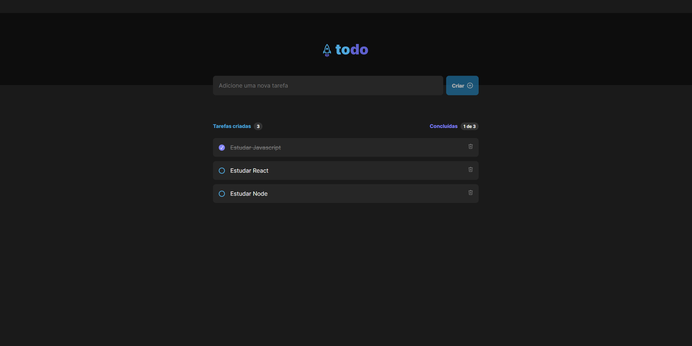

<h4 align="center">
  ToDo List
</h4>

  <a href="#-tecnologias">Tecnologias</a>&nbsp;&nbsp;&nbsp;|&nbsp;&nbsp;&nbsp;
  <a href="#-projeto">Projeto</a>&nbsp;&nbsp;&nbsp;|&nbsp;&nbsp;&nbsp;
  <a href="#-layout">Configuração</a>

 

  

## : Tecnologias

Esse projeto foi desenvolvido com as seguintes tecnologias:

- [React](https://reactjs.org)
- [TypeScript](https://www.typescriptlang.org/)
- [Vite](https://vitejs.dev/guide/#scaffolding-your-first-vite-project)
- [Styled-Components](https://styled-components.com/)
- [CSS Modules]

## 💻 Projeto

O ToDo List é um desafio proposto pelo Bootcamp Ignite da Rocketseat, ao qual utilizamos os conceitos básicos do React para desenvolver do zero uma simples lista de tarefas com as opções de criar e apagar um item da lista 

## ⚙ Configuração

1- Antes de começar, você vai precisar instalar na sua máquina as seguintes ferramentas: Git, Node. Além disso, é bom ter um editor para trabalhar com código, como o <a href="https://code.visualstudio.com/download">VSCode</a>.

Para instalar as dependências no front-end:
> npm install
Para iniciar a aplicação no front-end:
> npm run dev
